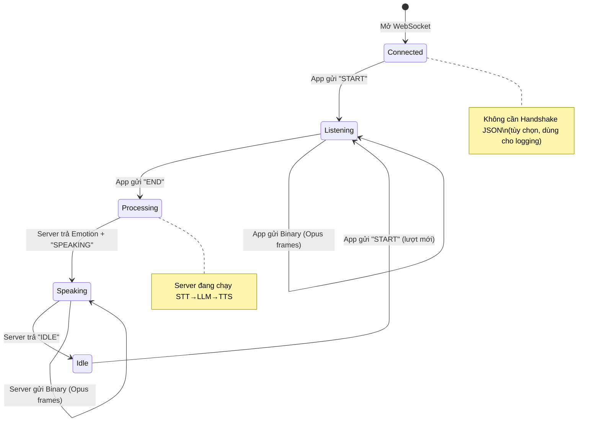

# PTalk Kids — Hướng dẫn Tích hợp WebSocket Streaming cho Android App

> **Ngày cập nhật:** 2026-05-13  
> **Trạng thái:** ✅ Đã kiểm thử E2E qua Nginx (STT + TTS streaming)

---

## 1. Tổng quan Kiến trúc

```
┌──────────────────┐     WebSocket (ws://)      ┌────────────────────┐
│   Android App    │ ◄══════════════════════════► │   Nginx Gateway    │
│  (OkHttp + Opus) │        Port 8000            │   /voice/ → :8002  │
└──────────────────┘                             └────────┬───────────┘
                                                          │
                                                          ▼
                                                 ┌────────────────────┐
                                                 │  kids/main.py      │
                                                 │  (Uvicorn :8002)   │
                                                 └────────┬───────────┘
                                                          │ Redis Stream
                                              ┌───────────┼───────────┐
                                              ▼           ▼           ▼
                                          ┌───────┐  ┌────────┐  ┌───────┐
                                          │  STT  │  │  LLM   │  │  TTS  │
                                          │Whisper│→ │Gemma 4 │→ │Omni-  │
                                          │Medium │  │ MoE    │  │Voice  │
                                          └───────┘  └────────┘  └───────┘
```

App Android kết nối **một lần** qua WebSocket, giữ kết nối liên tục (Keep-Alive).  
Mỗi lượt hỏi-đáp diễn ra trong cùng một kết nối, **không cần ngắt và kết nối lại**.

---

## 2. Thông số Kỹ thuật

| Thông số | Giá trị |
|---|---|
| **Giao thức** | WebSocket (`ws://` hoặc `wss://`) |
| **Endpoint** | `ws://171.226.10.121:8000/voice/ws` |
| **Sample Rate** | `48000 Hz` (48kHz) |
| **Channels** | `1` (Mono) |
| **Bit Depth** | `16-bit` (PCM Signed Int16, Little-Endian) |
| **Opus Frame Size** | `960 samples` = `20ms` |
| **Opus Bitrate** | `64 kbps` (khuyến nghị) |
| **Byte Order (Length Prefix)** | **Little-Endian** |
| **Audio tối thiểu** | `300ms` (dưới ngưỡng này Server sẽ bỏ qua) |

---

## 3. Định dạng Gói tin Binary (Quan trọng!)

### Cấu trúc Frame: Length-Prefixed

Mỗi Opus frame khi truyền qua WebSocket **BẮT BUỘC** phải có 2 byte tiền tố ghi độ dài:

```
┌──────────────────────────────────────────────────┐
│  2 bytes (Uint16 LE)  │  N bytes (Opus data)     │
│  = Độ dài Opus data   │  = Frame đã nén          │
└──────────────────────────────────────────────────┘
```

**Ví dụ:** Nếu Opus encode ra 87 bytes, gói gửi đi sẽ là:
```
[0x57, 0x00]  ← 87 viết dạng Little-Endian (Uint16)
[87 bytes Opus data...]
```

### Ghép nhiều Frame trong một lượt gửi (Batch)

Một gói WebSocket Binary có thể chứa **nhiều frame nối liền nhau**:

```
[Len1_LE][Opus1][Len2_LE][Opus2][Len3_LE][Opus3]...
```

**Khuyến nghị:** Gộp 5–10 frame mỗi lượt gửi (~100–200ms audio) để giảm overhead mạng.

---

## 4. Giao thức Giao tiếp (State Machine)

### 4.1 Sơ đồ Trạng thái



### 4.2 Chi tiết từng bước

#### Bước 0: Kết nối WebSocket
```
App  →  ws://171.226.10.121:8000/voice/ws
```
Khi kết nối thành công, App **có thể** (không bắt buộc) gửi JSON nhận dạng:
```json
{"device_id": "android_user_12345", "firmware_version": "2.0.0"}
```
> Server dùng `device_id` để phân biệt session. Nếu không gửi, server sẽ gán ID tự động.

#### Bước 1: Bắt đầu thu âm — App gửi `"START"`
```
App  →  Text: "START"
App  ←  Text: "LISTENING"     ← Server xác nhận đang lắng nghe
```
Khi nhận `LISTENING`, App bắt đầu ghi âm từ `AudioRecord` và encode Opus.

#### Bước 2: Gửi Audio — App gửi Binary liên tục
```
App  →  Binary: [Len1][Opus1][Len2][Opus2]...    (mỗi ~100-200ms)
App  →  Binary: [Len1][Opus1][Len2][Opus2]...
...
```
Liên tục gửi cho đến khi người dùng nhả nút.

#### Bước 3: Kết thúc thu âm — App gửi `"END"`
```
App  →  Text: "END"
App  ←  Text: "PROCESSING"    ← Server xác nhận đang xử lý AI
```
**Từ đây App NGỪNG gửi audio**, chuyển sang chế độ chờ và lắng nghe.

#### Bước 4: Nhận phản hồi AI — Server stream Audio về
```
App  ←  Text: "10"            ← Mã cảm xúc (2 ký tự số)
App  ←  Text: "SPEAKING"      ← Báo hiệu sắp có audio
App  ←  Binary: [Opus frames batched]    ← Audio chunk 1
App  ←  Binary: [Opus frames batched]    ← Audio chunk 2
...
App  ←  Text: "IDLE"          ← Kết thúc phản hồi
```

#### Bước 5: Quay về trạng thái rảnh
Khi nhận `"IDLE"`, App:
1. Dừng phát audio (flush buffer)
2. Reset Opus Decoder state
3. Sẵn sàng cho lượt hỏi tiếp theo (quay lại Bước 1)

**KHÔNG NGẮT kết nối WebSocket** — giữ để tái sử dụng.

---

## 5. Bảng Mã Cảm xúc

| Mã | Ý nghĩa | Gợi ý UI |
|---|---|---|
| `00` | Bình thường / Trung tính | Mặt cười mặc định |
| `01` | Buồn / Cảm thông | Mặt buồn |
| `02` | Lo lắng / Quan ngại | Mặt lo |
| `10` | Vui vẻ / Hào hứng | Mặt cười tươi |
| `11` | Giận dữ / Nghiêm túc | Mặt nghiêm |
| `20` | Ngạc nhiên | Mặt ngạc nhiên |

---

## 6. Lệnh Đặc biệt

| Lệnh (App gửi) | Phản hồi Server | Mô tả |
|---|---|---|
| `START` | `LISTENING` | Bắt đầu phiên thu âm mới |
| `END` | `PROCESSING` | Kết thúc thu âm, bắt đầu AI |
| `CLEAR_SESSION` | `SESSION_CLEARED` | Xoá lịch sử hội thoại, bắt đầu phiên mới |

> **Interrupt (Ngắt giữa chừng):** Nếu Server đang `SPEAKING` mà App gửi `START`, Server sẽ **tự động ngắt** audio đang phát và chuyển sang lắng nghe lượt mới.

---

## 7. Mã Kotlin Mẫu Hoàn chỉnh

### 7.1 Dependencies (build.gradle)

```groovy
dependencies {
    // WebSocket
    implementation 'com.squareup.okhttp3:okhttp:4.12.0'
    
    // Opus Codec (Pure Java, không cần NDK)
    implementation 'org.concentus:concentus:1.0.2'
}
```

### 7.2 OpusHelper — Encode/Decode Wrapper

```kotlin
import org.concentus.*

class OpusHelper {
    companion object {
        const val SAMPLE_RATE = 48000
        const val FRAME_SIZE = 960  // 20ms @ 48kHz
        const val CHANNELS = 1
        const val BITRATE = 64000
    }

    private var encoder: OpusEncoder? = null
    private var decoder: OpusDecoder? = null

    fun initEncoder() {
        encoder = OpusEncoder(SAMPLE_RATE, CHANNELS, OpusApplication.OPUS_APPLICATION_AUDIO).apply {
            setBitrate(BITRATE)
            setComplexity(10)
            setSignalType(OpusSignal.OPUS_SIGNAL_VOICE)
        }
    }

    fun initDecoder() {
        decoder = OpusDecoder(SAMPLE_RATE, CHANNELS)
    }

    fun resetEncoder() {
        encoder?.resetState()
    }

    fun resetDecoder() {
        decoder?.resetState()
    }

    /**
     * Encode 960 samples PCM (Short) → Length-Prefixed Opus bytes
     * Format: [2 bytes LE length][Opus data]
     */
    fun encode(pcmShort: ShortArray): ByteArray {
        val enc = encoder ?: throw IllegalStateException("Encoder not init")
        val outputBuffer = ByteArray(1275) // Max Opus frame size
        val encodedLength = enc.encode(pcmShort, 0, FRAME_SIZE, outputBuffer, 0, outputBuffer.size)

        // Build length-prefixed frame
        val result = ByteArray(2 + encodedLength)
        // Little-Endian uint16
        result[0] = (encodedLength and 0xFF).toByte()
        result[1] = ((encodedLength shr 8) and 0xFF).toByte()
        System.arraycopy(outputBuffer, 0, result, 2, encodedLength)
        return result
    }

    /**
     * Decode một Binary message chứa nhiều Length-Prefixed Opus frames
     * → Trả về mảng PCM Short[]
     */
    fun decodeMessage(data: ByteArray): ShortArray {
        val dec = decoder ?: throw IllegalStateException("Decoder not init")
        val allPcm = mutableListOf<ShortArray>()
        var offset = 0

        while (offset + 2 <= data.size) {
            // Đọc 2 bytes Little-Endian
            val frameLen = (data[offset].toInt() and 0xFF) or
                          ((data[offset + 1].toInt() and 0xFF) shl 8)
            if (frameLen == 0 || offset + 2 + frameLen > data.size) break

            val opusData = data.copyOfRange(offset + 2, offset + 2 + frameLen)
            val pcmBuffer = ShortArray(FRAME_SIZE)
            dec.decode(opusData, 0, opusData.size, pcmBuffer, 0, FRAME_SIZE, false)
            allPcm.add(pcmBuffer)

            offset += 2 + frameLen
        }

        // Ghép tất cả PCM blocks lại
        val totalSamples = allPcm.sumOf { it.size }
        val result = ShortArray(totalSamples)
        var pos = 0
        for (block in allPcm) {
            System.arraycopy(block, 0, result, pos, block.size)
            pos += block.size
        }
        return result
    }
}
```

### 7.3 PTalkWebSocket — Giao tiếp chính

```kotlin
import android.media.AudioFormat
import android.media.AudioRecord
import android.media.AudioTrack
import android.media.MediaRecorder
import okhttp3.*
import okio.ByteString
import okio.ByteString.Companion.toByteString
import java.nio.ByteBuffer
import java.nio.ByteOrder
import java.util.concurrent.TimeUnit

class PTalkWebSocket(
    private val serverUrl: String = "ws://171.226.10.121:8000/voice/ws",
    private val listener: PTalkListener
) {
    interface PTalkListener {
        fun onStateChanged(state: PTalkState)
        fun onEmotionReceived(emotionCode: String)
        fun onError(message: String)
    }

    enum class PTalkState {
        DISCONNECTED, CONNECTED, LISTENING, PROCESSING, SPEAKING, IDLE
    }

    private val client = OkHttpClient.Builder()
        .readTimeout(0, TimeUnit.MILLISECONDS)  // WebSocket keep-alive
        .build()

    private var webSocket: WebSocket? = null
    private val opus = OpusHelper()

    // Audio Playback
    private var audioTrack: AudioTrack? = null

    // Audio Record
    private var audioRecord: AudioRecord? = null
    private var isRecording = false

    fun connect() {
        opus.initEncoder()
        opus.initDecoder()
        initAudioTrack()

        val request = Request.Builder().url(serverUrl).build()
        webSocket = client.newWebSocket(request, object : WebSocketListener() {

            override fun onOpen(ws: WebSocket, response: Response) {
                // Gửi handshake (tùy chọn)
                ws.send("""{"device_id":"android_app","firmware_version":"2.0.0"}""")
                listener.onStateChanged(PTalkState.CONNECTED)
            }

            override fun onMessage(ws: WebSocket, text: String) {
                when (text) {
                    "LISTENING" -> listener.onStateChanged(PTalkState.LISTENING)
                    "PROCESSING" -> listener.onStateChanged(PTalkState.PROCESSING)
                    "SPEAKING" -> {
                        audioTrack?.play()
                        listener.onStateChanged(PTalkState.SPEAKING)
                    }
                    "IDLE" -> {
                        audioTrack?.stop()
                        audioTrack?.flush()
                        opus.resetDecoder()
                        listener.onStateChanged(PTalkState.IDLE)
                    }
                    "SESSION_CLEARED" -> { /* Phiên đã xoá */ }
                    else -> {
                        // Mã cảm xúc: chuỗi 2 ký tự số (VD: "00", "10", "02")
                        if (text.length == 2 && text.all { it.isDigit() }) {
                            listener.onEmotionReceived(text)
                        }
                    }
                }
            }

            override fun onMessage(ws: WebSocket, bytes: ByteString) {
                // Nhận Audio streaming từ Server
                val pcmShort = opus.decodeMessage(bytes.toByteArray())
                if (pcmShort.isNotEmpty()) {
                    audioTrack?.write(pcmShort, 0, pcmShort.size)
                }
            }

            override fun onFailure(ws: WebSocket, t: Throwable, response: Response?) {
                listener.onError("WebSocket lỗi: ${t.message}")
                listener.onStateChanged(PTalkState.DISCONNECTED)
            }

            override fun onClosed(ws: WebSocket, code: Int, reason: String) {
                listener.onStateChanged(PTalkState.DISCONNECTED)
            }
        })
    }

    /** Bắt đầu thu âm — gọi khi user nhấn nút */
    fun startRecording() {
        webSocket?.send("START") ?: return

        isRecording = true
        Thread {
            initAudioRecord()
            audioRecord?.startRecording()

            val buffer = ShortArray(OpusHelper.FRAME_SIZE)   // 960 samples
            val batchFrames = mutableListOf<ByteArray>()
            var frameCount = 0

            while (isRecording) {
                val read = audioRecord?.read(buffer, 0, buffer.size) ?: 0
                if (read == OpusHelper.FRAME_SIZE) {
                    val encoded = opus.encode(buffer)
                    batchFrames.add(encoded)
                    frameCount++

                    // Gộp 5 frames (~100ms) rồi gửi 1 lượt
                    if (frameCount % 5 == 0) {
                        val totalSize = batchFrames.sumOf { it.size }
                        val batch = ByteArray(totalSize)
                        var offset = 0
                        for (frame in batchFrames) {
                            System.arraycopy(frame, 0, batch, offset, frame.size)
                            offset += frame.size
                        }
                        webSocket?.send(batch.toByteString())
                        batchFrames.clear()
                    }
                }
            }

            // Gửi nốt phần dư
            if (batchFrames.isNotEmpty()) {
                val totalSize = batchFrames.sumOf { it.size }
                val batch = ByteArray(totalSize)
                var offset = 0
                for (frame in batchFrames) {
                    System.arraycopy(frame, 0, batch, offset, frame.size)
                    offset += frame.size
                }
                webSocket?.send(batch.toByteString())
            }

            audioRecord?.stop()
        }.start()
    }

    /** Kết thúc thu âm — gọi khi user nhả nút */
    fun stopRecording() {
        isRecording = false
        opus.resetEncoder()
        webSocket?.send("END")
    }

    /** Xoá lịch sử hội thoại */
    fun clearSession() {
        webSocket?.send("CLEAR_SESSION")
    }

    /** Ngắt kết nối */
    fun disconnect() {
        isRecording = false
        audioRecord?.release()
        audioTrack?.release()
        webSocket?.close(1000, "User disconnect")
    }

    private fun initAudioTrack() {
        val bufferSize = AudioTrack.getMinBufferSize(
            OpusHelper.SAMPLE_RATE,
            AudioFormat.CHANNEL_OUT_MONO,
            AudioFormat.ENCODING_PCM_16BIT
        )
        audioTrack = AudioTrack.Builder()
            .setAudioFormat(
                AudioFormat.Builder()
                    .setSampleRate(OpusHelper.SAMPLE_RATE)
                    .setChannelMask(AudioFormat.CHANNEL_OUT_MONO)
                    .setEncoding(AudioFormat.ENCODING_PCM_16BIT)
                    .build()
            )
            .setBufferSizeInBytes(maxOf(bufferSize, OpusHelper.SAMPLE_RATE * 2)) // ~1s buffer
            .setTransferMode(AudioTrack.MODE_STREAM)
            .build()
    }

    private fun initAudioRecord() {
        val bufferSize = AudioRecord.getMinBufferSize(
            OpusHelper.SAMPLE_RATE,
            AudioFormat.CHANNEL_IN_MONO,
            AudioFormat.ENCODING_PCM_16BIT
        )
        audioRecord = AudioRecord(
            MediaRecorder.AudioSource.MIC,
            OpusHelper.SAMPLE_RATE,
            AudioFormat.CHANNEL_IN_MONO,
            AudioFormat.ENCODING_PCM_16BIT,
            maxOf(bufferSize, OpusHelper.SAMPLE_RATE * 2)
        )
    }
}
```

### 7.4 Sử dụng trong Activity

```kotlin
class VoiceActivity : AppCompatActivity(), PTalkWebSocket.PTalkListener {

    private lateinit var ptalk: PTalkWebSocket
    private var currentState = PTalkWebSocket.PTalkState.DISCONNECTED

    override fun onCreate(savedInstanceState: Bundle?) {
        super.onCreate(savedInstanceState)
        setContentView(R.layout.activity_voice)

        ptalk = PTalkWebSocket(listener = this)
        ptalk.connect()

        // Push-to-Talk Button
        findViewById<Button>(R.id.btnTalk).setOnTouchListener { _, event ->
            when (event.action) {
                MotionEvent.ACTION_DOWN -> {
                    if (currentState in listOf(
                        PTalkWebSocket.PTalkState.CONNECTED,
                        PTalkWebSocket.PTalkState.IDLE,
                        PTalkWebSocket.PTalkState.SPEAKING  // Interrupt
                    )) {
                        ptalk.startRecording()
                    }
                    true
                }
                MotionEvent.ACTION_UP -> {
                    ptalk.stopRecording()
                    true
                }
                else -> false
            }
        }
    }

    override fun onStateChanged(state: PTalkWebSocket.PTalkState) {
        currentState = state
        runOnUiThread {
            when (state) {
                PTalkWebSocket.PTalkState.CONNECTED -> showStatus("Đã kết nối ✅")
                PTalkWebSocket.PTalkState.LISTENING -> showStatus("Đang lắng nghe... 🎤")
                PTalkWebSocket.PTalkState.PROCESSING -> showStatus("Đang suy nghĩ... 🤔")
                PTalkWebSocket.PTalkState.SPEAKING -> showStatus("Đang trả lời... 🔊")
                PTalkWebSocket.PTalkState.IDLE -> showStatus("Sẵn sàng 😊")
                PTalkWebSocket.PTalkState.DISCONNECTED -> showStatus("Mất kết nối ❌")
            }
        }
    }

    override fun onEmotionReceived(emotionCode: String) {
        runOnUiThread {
            // Cập nhật avatar/animation theo cảm xúc
            updateAvatarEmotion(emotionCode)
        }
    }

    override fun onError(message: String) {
        runOnUiThread { Toast.makeText(this, message, Toast.LENGTH_SHORT).show() }
    }

    override fun onDestroy() {
        ptalk.disconnect()
        super.onDestroy()
    }
}
```

---

## 8. Checklist Kiểm thử

| # | Mục kiểm tra | Cách test |
|---|---|---|
| 1 | WebSocket kết nối qua Nginx | Gọi `ws://171.226.10.121:8000/voice/ws` |
| 2 | Health check qua Nginx | `curl http://171.226.10.121:8000/voice/health` |
| 3 | Handshake → LISTENING | Gửi `START`, nhận được `LISTENING` |
| 4 | Upload Opus binary | Gửi binary frames, không có lỗi |
| 5 | END → PROCESSING | Gửi `END`, nhận được `PROCESSING` |
| 6 | Nhận Emotion code | Nhận chuỗi 2 số (VD: `"10"`) |
| 7 | Nhận SPEAKING | Nhận text `"SPEAKING"` |
| 8 | Stream audio về | Nhận binary, decode ra PCM, nghe được |
| 9 | Nhận IDLE | Nhận text `"IDLE"` khi AI nói xong |
| 10 | Interrupt | Gửi `START` khi đang SPEAKING → ngắt audio cũ |
| 11 | CLEAR_SESSION | Gửi `CLEAR_SESSION` → nhận `SESSION_CLEARED` |

---

## 9. Lưu ý Quan trọng

### ⚠️ KHÔNG DÙNG MediaRecorder
`MediaRecorder` đóng gói audio vào container `.ogg` hoặc `.m4a`. Server **KHÔNG** nhận file bọc vỏ. Phải dùng `AudioRecord` (PCM thô) + Opus encode thủ công.

### ⚠️ Byte Order là Little-Endian
2 bytes length prefix phải ghi dạng **Little-Endian** (`0x57 0x00` cho giá trị 87). Sai byte order sẽ khiến Server decode Opus thất bại hoàn toàn.

### ⚠️ Reset Opus State
- **Sau mỗi lượt nói (nhận IDLE):** Gọi `decoder.resetState()` để tránh tạp âm giữa các phiên.
- **Sau mỗi lượt thu (gửi END):** Gọi `encoder.resetState()`.

### ⚠️ Jitter Buffer cho Playback
Nên set `AudioTrack` buffer size tối thiểu **1 giây** (`48000 * 2 bytes = 96000 bytes`) để tránh vỡ tiếng khi mạng jitter. Code mẫu ở trên đã set `SAMPLE_RATE * 2`.

### ⚠️ Giữ kết nối WebSocket
Không ngắt WebSocket sau khi nhận `IDLE`. Việc giữ kết nối liên tục (Keep-Alive) tiết kiệm đáng kể thời gian TCP/TLS handshake. TTFB hiện tại đo được khoảng **2s – 6s** tuỳ độ dài câu hỏi.

---

## 10. Kết quả Kiểm thử Thực tế

### Test qua Nginx (`ws://171.226.10.121:8000/voice/ws`):
```
✅ WebSocket kết nối          — OK
✅ Handshake                  — OK  
✅ START → LISTENING           — OK
✅ Gửi 135 Opus frames         — OK
✅ END → PROCESSING            — OK
✅ STT dịch chính xác          — "ĐỌC CHO TÔI BÀI THƠ NHỚ RỪNG" (0.60s)
⏸️ Audio streaming về          — Chưa test được (LLM Gemma 4 đang tắt)
```

### Test trực tiếp qua port 8002 (khi LLM còn sống):
```
✅ TTFB (Time to First Byte)   — 5.82s
✅ Emotion code                — "10" (Vui vẻ)
✅ SPEAKING → Binary stream    — OK
✅ IDLE                        — OK
✅ Tổng audio nhận             — 282,240 samples (5.88s audio)
✅ Tổng thời gian              — 15.22s
```
