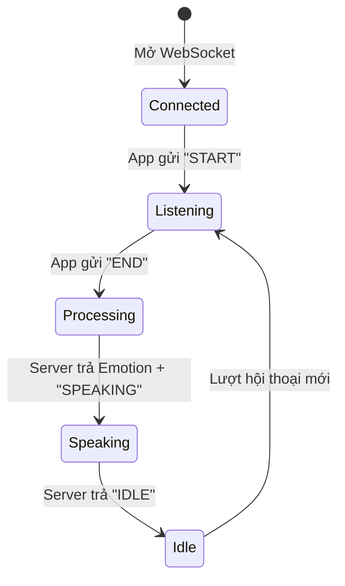

# PTalk Kids V2 — Hướng dẫn Tích hợp & Giao thức Mạng (Android App)

> **Ngày cập nhật:** 2026-05-13
> **Trạng thái:** ✅ Đã hoàn thiện cơ chế Fallback (WS + HTTP) và Chống nghẽn luồng.

---

## 1. Kiến trúc Đa luồng (Hybrid Transport)

Do thực trạng phân mảnh phần cứng Android (đặc biệt là máy chạy Android 16 bị cắt giảm MediaCodec Opus), PTalk V2 sử dụng cơ chế **Tự động chuyển đổi (Auto Fallback)**:

- **Đường chính (WebSocket - Opus):** Độ trễ siêu thấp, streaming thời gian thực (dành cho 90% thiết bị hỗ trợ Opus).
- **Đường dự phòng (HTTP - M4A/WAV):** Dành cho các thiết bị kén phần cứng (được kích hoạt khi Health Check báo lỗi HTTP hoặc khi khởi tạo bộ nén Opus thất bại).

### Các Endpoints (Qua Nginx API Gateway Cổng 8000)
- **Health Check:** `GET http://171.226.10.121:8000/voice/health` (Phải trả về chuỗi `"ok"`).
- **WebSocket:** `ws://171.226.10.121:8000/voice/ws`
- **HTTP Fallback:** `POST http://171.226.10.121:8000/voice/process` (hoặc `/process`)

> **Lưu ý Nginx:** API Gateway bắt buộc phải cấu hình `proxy_pass http://host.docker.internal:8002/;` (có dấu `/` ở cuối) và 3 dòng Upgrade header cho WebSocket.

---

## 2. Giao thức WebSocket (Luồng chính)

App Android kết nối **một lần**, giữ kết nối liên tục (Keep-Alive) qua OkHttp.

### Sơ đồ Trạng thái (State Machine)



### Các bước giao tiếp:

1. **Kết nối:** App kết nối tới `ws://.../voice/ws`. Có thể gửi JSON khởi tạo `{"device_id": "xxx"}`.
2. **Thu âm (START):**
   - App gửi Text: `"START"`
   - Server trả Text: `"LISTENING"`
   - Bắt đầu thu âm bằng `AudioRecord` (PCM 48kHz).
3. **Gửi Audio (Liên tục):**
   - Nén PCM thành Opus. Đóng gói theo chuẩn **Length-Prefixed Little-Endian** (2 bytes biểu diễn độ dài Opus data, theo sau là Opus data).
   - *Khuyến nghị:* Gộp 5 frames (khoảng 100ms) thành 1 mảng byte rồi đẩy qua WebSocket.
4. **Kết thúc Thu (END):**
   - App gửi Text: `"END"`
   - Server trả Text: `"PROCESSING"` (Bắt đầu chạy AI Pipeline).
5. **Nhận Phản hồi AI:**
   - Server trả Mã cảm xúc (Ví dụ: `"00"` = Bình thường, `"10"` = Vui vẻ).
   - Server trả Text: `"SPEAKING"`.
   - Server liên tục trả Binary Data (Opus frames). App giải nén và đưa ra loa.
6. **Kết thúc (IDLE):**
   - Server trả Text: `"IDLE"`. App sẵn sàng cho lượt nói tiếp theo.

---

## 3. Kiến trúc Chống Nghẽn Loa (Anti-Blocking) - CỰC KỲ QUAN TRỌNG

**Vấn đề:** 
Lỗi `1006 (connection closed abnormally)` xảy ra ở giây thứ ~50 của các câu trả lời dài (như đọc thơ Nhớ Rừng). Nguyên nhân **KHÔNG PHẢI** do Server cắt, mà do `AudioTrack.write()` của Android (hoặc `aplay` trên Linux) bị kẹt khi bộ đệm đầy. Việc hàm ghi loa bị kẹt (Blocking IO) sẽ chặn đứng luồng mạng (Event Loop), khiến OkHttp không thể nhận PING/PONG. Quá 40 giây, OkHttp tự động tự sát.

**Giải pháp bắt buộc (Đã áp dụng trong `StreamingAudioPlayer.kt`):**
BẮT BUỘC phải tách riêng luồng mạng và luồng loa thông qua **Hàng đợi Thread-Safe**.

```mermaid
graph LR
    A[OkHttp WebSocket Luồng Mạng] -->|1. Nhận Binary| B(Opus Decoder)
    B -->|2. PCM Data| C{ConcurrentLinkedQueue}
    C -->|3. Lấy Data| D[Luồng Phát Loa Độc Lập]
    D -->|4. write() block| E((AudioTrack))
    
    style A fill:#e1f5fe,stroke:#03a9f4
    style D fill:#fce4ec,stroke:#e91e63
    style C fill:#fff3e0,stroke:#ff9800
```

1. **Luồng WebSocket (`onMessage`):** Chỉ làm nhiệm vụ Decode Opus và ném `ShortArray` vào `ConcurrentLinkedQueue`. Tuyệt đối không gọi `AudioTrack.write()` ở đây. Mất < 1ms, mạng luôn thông suốt.
2. **Luồng Loa (`Thread`):** Dùng một vòng lặp `while(true)` túc tắc lấy `ShortArray` từ `Queue` ra và gọi `AudioTrack.write()`. Nếu loa bị đầy, chỉ có luồng này bị kẹt, luồng mạng hoàn toàn không bị ảnh hưởng.

---

## 4. Cấu hình Server-Side & Timeout

Để các tính năng sinh văn bản dài không bị đứt gánh, Server cần được thiết lập như sau:

1. **Backend Pipeline Timeout (`PIPELINE_TIMEOUT`):**
   - Mặc định cũ là 60s (Gây đứt ngang khi đọc thơ).
   - Đã nâng cấp lên **300s** trong file `kids/settings.py` và `shared/redis_bus.py`.
2. **Nginx API Gateway Timeout (`nginx.conf`):**
   - Bắt buộc phải có `proxy_read_timeout 600s;` và `proxy_send_timeout 600s;` để Nginx không cắt ngang kết nối WebSocket khi LLM đang "suy nghĩ" quá lâu.
3. **Multi-Collection RAG:**
   - Đã hỗ trợ truy vấn chéo (Math, Science, Social) trả về list gộp (trong `rag_server.py`). Hoàn toàn tự động, App không cần truyền thêm cờ hiệu chuyên biệt nào ngoài text transcript.
